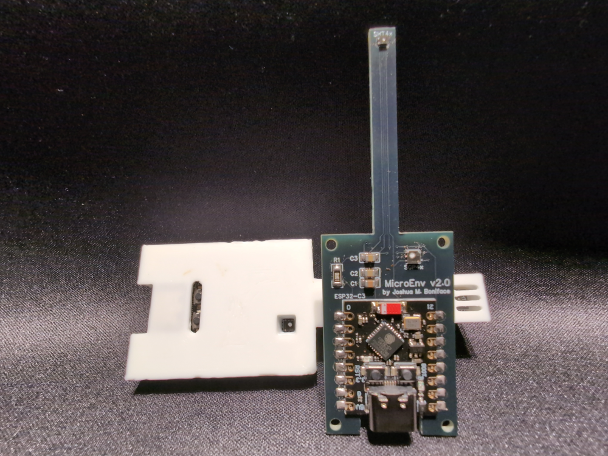

# MicroEnv v2.x

The MicroEnv is a compact and simplistic environmental monitoring sensor, based on the ESP32-C3 and the Sensirion SGP41 VOC/NOx and SHT45 temperature/humidity sensors, using ESPHome for integration with HomeAssistant.

Use a MicroEnv near a source of emissions to monitor air quality, evaluate temperatures, or as a general room environmental tracking sensor. It is, in effect, a cut down version of the environmental sensor package of my [SuperSensor](https://github.com/joshuaboniface/supersensor) project in a standalone footprint designed for maximum temperature accuracy.

Power is provided by USB-C, which is also used for initial flashing. Once running, the device connects to WiFi to provide data to Home Assistant or via the ESPHome WebUI/API.

The Sensirion sensors are directly soldered onto the board along with their power management circuitry, using SMD techniques, which is in contrast to the socketed GY-form-factor sensors from [version 1.x](https://github.com/joshuaboniface/microenv/tree/v1.x). This provides more compactness and flexibility in terms of positioning to ensure the temperature sensor is properly isolated from the rest of the system.

Version 2.x features an extended 5mm-width, 40mm-length "neck", the end of which contains the SHT45 temperature sensor, for maximum isolation from the ESP32 and SGP41 sensor, both of which produce heat which can negatively affect the SHT45 temperature. This emulates the design of many temperature probe devices which use similar long boards for isolation purposes and work quite well in this regard.

The PCB design details and assembly instructions can be found [in /board](board/) and on [OSHWLab](https://oshwlab.com/joshuaboniface/microenv-2-0).

Since this revision uses directly SMD-mounted components, it requires fine soldering using solder paste and either a hotplate or, with extreme care, hot air soldering techniques. It is strongly recommended that anyone attempting to build one read the datasheets for the [SHT45](https://sensirion.com/media/documents/33FD6951/67EB9032/HT_DS_Datasheet_SHT4x_5.pdf) and [SGP41](https://sensirion.com/media/documents/5FE8673C/61E96F50/Sensirion_Gas_Sensors_Datasheet_SGP41.pdf) sensors thoroughly to ensure they are not subject to overheating which can result in potential damage or incorrect operation. We recommend using low-temperature GA-SN solder paste for this purpose, and suggest ordering the PCB with lead-free HASL to facilitate this.

## v1.x Compatibility

The only changes between v1.x and v2.x are in the board layout and component mounting; for software purposes, both versions are functionally identical aside from versioning. Thus all changes should be ported to both the `v1.x` and `v2.x` branches. There is no `master` branch.

## Parts List

**Note:** All prices are $CAD, as of late November 2025, excluding shipping, sales, and bulk discounts beyond those indicated.

**Note:** For AliExpress item links marked `*`, ensure you select the correct device; multiple different models share the page.

| Qty   | PCB ID(s) | Component                                      | Cost                | Links |
|-------|-----------|------------------------------------------------|---------------------|-------|
| 1     | N/A       | PCB - "MicroEnv"                               | $0.64 ($3.20/5)     | [EasyEDA/JLCPCB](/board/pcb.easyeda.json) |
| 1     | ESP32-C3  | ESP32-C3 development board (SMD)               | $2.46 ($12.28/5)    | [AliExpress](https://www.aliexpress.com/item/1005007205044247.html)*  |
| 1     | SHT4x     | Sensirion SHT45-AD1F-R2                        | $9.37               | [DigiKey.ca](https://www.digikey.ca/en/products/detail/sensirion-ag/SHT45-AD1F-R2/17180856) |
| 1     | SGP4x     | Sensirion SGP41-D-R4                           | $13.00              | [DigiKey.ca](https://www.digikey.ca/en/products/detail/sensirion-ag/SGP41-D-R4/15652788) |
| 1     | R1        | CR1206-FX-10R0ELFCT-ND (10Ω 1% 1/4W 1206)      | $0.16               | [DigiKey.ca](https://www.digikey.ca/en/products/detail/bourns-inc/CR1206-FX-10R0ELF/2562695) |
| 1     | C1        | 399-C0805C106K8PACTUCT-ND (10μF 10V X5R 0805)  | $0.19               | [DigiKey.ca](https://www.digikey.ca/en/products/detail/kemet/C0805C106K8PACTU/1090830) |
| 1     | C2        | 399-C0805C104K5RACTUCT-ND (0.1μF 50V X7R 0805) | $0.12               | [DigiKey.ca](https://www.digikey.ca/en/products/detail/kemet/C0805C104K5RACTU/411169) |
| 1     | C3        | 399-C0805C105K3RACTUCT-ND (1μF 50V X7R 0805)   | $0.18               | [DigiKey.ca](https://www.digikey.ca/en/products/detail/kemet/C0805C105K3RACTU/2211765) |
| **T** |           |                                                | **$26.14**          | *plus tools, solder, etc.* |

## Case

The MicroEnv design includes [a case to enclose the sensor](case/) while still providing good airflow to cool the microcontroller and provide quality exposure for the sensors. This case can be printed in any material, though ABS is recommended for rigidity and strength.

## Calibration

Due to its design explicitly focusing on temperature accuracy, the MicroEnv should not require any Temperature Offset corrections in normal use; the option is however still provided just in case this is required in your environment.

The heater component of the SHT45 is explicitly disabled, as this should only be required in extreme humidity conditions.

Like its parent SuperSensor, the MicroEnv provides several additional configurable options for a "Room Health" metric system. For more detail, see [the main SuperSensor README](https://github.com/joshuaboniface/supersensor/tree/v3.x/configuration#room-health) section on the Room Health system.

# Contributing

If you wish to contribute to the MicroEnv project, please open a pull request in this repository. All pull requests will be carefully reviewed before inclusion, as we are extremely selective about what we modify. Note that any signifiant logical changes should also be compatible with the SuperSensor, and changes from that project will be occasionally integrated here.

Please ensure you target the correct branch(es) for your changes. Currently we are supporting both `v1.x` and `v2.x` in software as noted above, and there is no `master`/`main` branch. This support of both `v1.x` and `v2.x` means a 1-to-1 correlation of functionality between those two versions, so any PR to one will be back- or forward-ported to the other, and your changes(s) must be compatable with both.

Any changes must be **globally applicable to all users** of the project; if you wish to maintain your own customizations that are only applicable for yourself, please fork the project and adjust your package import URL accordingly.

"AI" (LLM) contributions are not prohibited, but you - a human - **must** at least review, reformat, and test the changes yourself before submitting them. Obviously pure-LLM-generated PRs that do not function, mangle formatting or functionality, or otherwise clearly have no human review will be rejected with prejudice. This extends to the PR body itself: write in your own words, not the output of an LLM, and if you can't concisely sumarize the changes yourself, then we're not interested in them.
