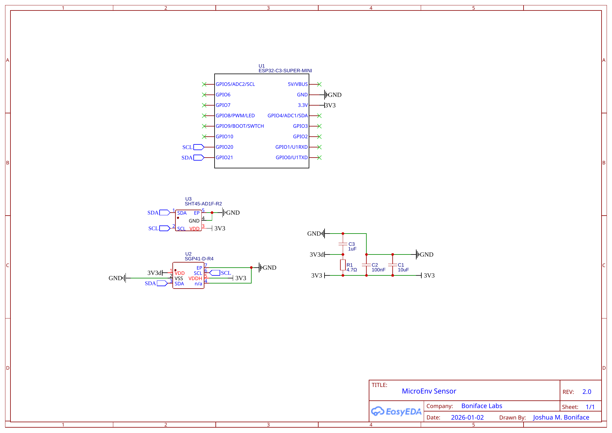
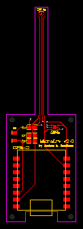

# MicroEnv v2.x Board Designs

This is a collection of [EasyEDA](https://easyeda.com/) schematics and board desgins for the MicroEnv v2.x's components.

You can import the design definition files (`*.easyeda.json`) directly into EasyEDA via "File" -> "Open" -> "EasyEDA". The schematic is provided for reference in both EasyEDA and SVG formats; if you just wish to manufacture the boards, you only need to import the board definitions, then via "Fabrication" -> "One-click Order PCB/SMT" complete the order at [JLCPCB](https://jlcpcb.com). We order all boards in a black silkscreen with all other options as default.

You can also see the designs directly on [OSHWLab here](https://oshwlab.com/joshuaboniface/microenv-2-0).

The board design and images in this folder are © 2026 [Joshua M. Boniface](https://www.boniface.me) and licensed under the [Creative Commons Attribution-ShareAlike (BY-SA) 4.0](LICENSE) license.

## Schematic

The schematic is visible here in SVG format, and also as an EasyEDA definition in [schematic.easyeda.json](schematic.easyeda.json).

The individual parts can be found, with their labels (`R1`, etc.) in the [main README parts list](https://github.com/joshuaboniface/microenv/tree/v2.x?tab=readme-ov-file#parts-list).

## Board

This is the main board of the MicroEnv which contains all components, with the SHT45 sensor on a long (40mm) "neck" to isolate it from the other components.

The board is single-sided; there are no components on the reverse side.

## Assembly

Assembly can be accomplished either by hot-air reflow, or with a hotplate. The instructions are functionally identical for both except for the heating step (#5).

The hot-air process requires the least tools, but is finicky and error-prone. The hotplate process is much simpler and more forgiving, but requires a suitable hotplate. We recommend using the hotplate method for any more than a very small number of MicroEnv sensors.

1. Clean all PCBs thoroughly with isopropyl alcohol and paper towel.

2. Carefully apply solder paste to each pad, with the following guidelines:

   * SHT45/SGP41: A very small amount on each pad, including the center pads; if you think it's not enough, it's just right.
   * Passive SMD components (R1, C1-3): A moderate amount on each pad focusing on the outer edges.
   * ESP32-C3: A very liberal amount on each pad for mechanical stability.

3. Place each component on its corresponding pad using tweezers. Ensure the components are properly aligned and then gently press them down into the solder paste.

   **NOTE**: Placing each component after its corresponding solder paste can avoid accidental smudging.

4. Heat the hot air station to 240C; no higher! Apply heat to the **bottom** of the PCB until all the solder reflows. Check carefully for any bridges or failed joins and gently reflow in the same way as necessary. **Never apply heat directly to the sensors themselves!**

5. Perform electrical continuity tests to ensure there are no stray bridges.

The MicroEnv is now fully assembled and ready for final testing/provisioning.
